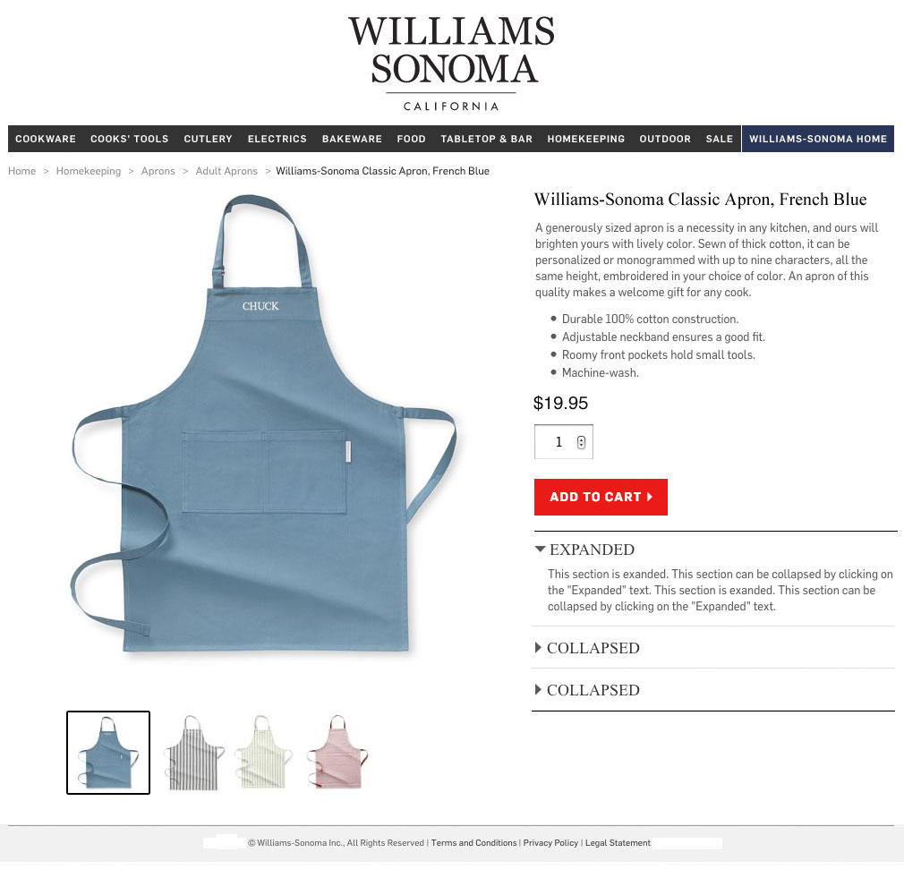

# Williams-Sonoma

*West Elm's Junior Front End Developer Markup Challenge:* A mock merchandise page of [Williams-Sonoma](https://www.williams-sonoma.com/), West Elm's parent company.

This challenge is built in JavaScript, jQuery, CSS and HTML5.

## Markup

## Requirements

Refer to the image above, put your page together with your JavaScript, CSS and HTML skills by:
- Using the small product images to update the large hero product image.
- Expanding and collapsing the sections on the lower right quadrant of the page.
- Display a modal or message after the Add to Cart button is clicked.

## Instructions

1. Fork and clone this repository to your local computer using `git clone https://github.com/Your-Username/Williams-Sonoma.git`.
2. Move into the root directory: `cd Williams-Sonoma`.
3. Serve `index.html` using a local server of your choice or double click the `html` file to open it in the browser directly.
4. If you're using **Visual Studio Code**, you can find and install the `Live Server` extension within VSC itself using the Extensions panel (⌘⇧X or the square icon in the left sidebar).
5. Right click anywhere in the `html` file and choose `Open with Live Server` or click on `Go Live` from blue StatusBar at the bottom of the editor.
6. See the `html` page showing at `http://127.0.0.1:5500/index.html`.

## Walkthrough

## Demo

Click [here](https://williams-sonoma.herokuapp.com/) to see the demo.
